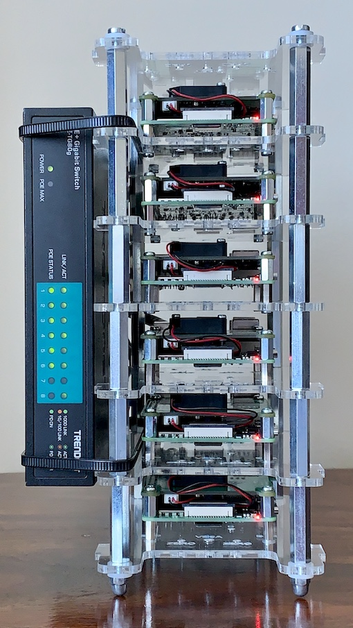

# IllegalException
About
Provisioning a Kubernetes cluster on Raspberry Pi with Ansible
Sep 12, 2019

The new Raspberry Pi model 4B is out and it’s a significant upgrade: Among other improvements, the new model has up to 4GB, real Gigabit Ethernet (no more throttling to USB 2.0 bandwidth) and a quad core Cortex-A72 (ARM64v8) CPU running at 1.5 GHz - see specifications. With all this power, why not build a Kubernetes cluster with it? Well, here we go: This posting shows you how you can setup a multi-node Kubernetes cluster on an array of Raspberry Pi’s in minutes!

To automate the provisioning, I have created an Ansible playbook which sets up either original Kubernetes (subsequently called k8s) or k3s, which is a certified Kubernetes variant with a smaller memory footprint. The playbook even supports partitioning your nodes so that some may form a k8s cluster while others form a k3s cluster. This can be useful for testing purposes.

The minimum number of nodes in any cluster is one for a single master node, but you should have at least two nodes, one master node and one worker node. The more worker nodes you can add, the better of course. At the time of this writing however, the playbook only supports a single master node. If you want more than one master node, then you need to manually reconfigure the cluster post setup.

Regardless of the Kubernetes variant, the playbook installs Docker as the container runtime, so that you can take advantage of Docker-specific features. For example, the playbook supports configuring an external Docker registry mirror. This can be used to reduce network traffic as otherwise every worker node individually pulls the same Docker images. For the same reason, the playbook also supports configuring an external HTTP(S) proxy. This can be used to make the provisioning a lot faster and more robust as every network operation (e.g. installing packages) is effectively done at most once for the first node while subsequent nodes will be served from the proxy’s cache.

If you need a private Docker registry, then this can be configured using image pull secrets in a post-master-up event hook (see below). I recommend adding image pull secrets to a service account, so that you don’t have to configure this for each pod individually.

For container networking, the playbook configures Flannel. This is the only choice with k3s anyway.

I have also created another playbook to properly tear down individual nodes or even the entire cluster. This allows you to re-purpose your hardware, e.g. a worker node can leave one cluster and join another or you can use it for something else.

## Prerequisites
### Hardware
The playbooks have been designed so that they do not depend on a particular hardware: They should work on anything which runs a Debian based Linux distribution, including EC2 instances on AWS. As a proof-of-concept, I’m running Kubernetes on an array of six Raspberry Pi 4’s with 4 GB memory each. Actually, as little as 1 GB memory is enough to run Kubernetes, but then there is not enough free memory to run many interesting apps.

An array of Raspberry Pi Model 4B


Also, for best performance, the Pi’s should be connected via Ethernet cable, not WiFi. There is a caveat, however: With Raspberry Pi 3 and earlier models, the Ethernet port is connected to the USB 2.0 controller, which effectively limits the available bandwidth to about 224 Mbps. In comparison, the Raspberry Pi 4 can sustain over 900 Mbps with adequate cooling. For my setup I have chosen the Power-over-Ethernet (PoE) HATs, which have a temperature-controlled fan.

All the performance is waisted if you go for a cheap switch: The problem with cheap switches is that their backplane often doesn’t provide enough bandwidth for full-duplex transmission on all ports in parallel - this is the same problem as with the Ethernet port on older Raspberry Pi models.
For best results, you need a switch with at least N + 1 ports (for N Pis’ plus an uplink to your router) and a backplane bandwidth of at least 2 * (N + 1) Gbps. For my setup I have chosen the TRENDnet TPE-TG80g, which is an unmanaged switch with 8 Gigabit Ethernet ports. Its backplane has a bandwidth capacity of 16 Gbps, so all its ports can transmit data at full bandwidth in parallel. The ports also feature Power-over-Ethernet Plus (PoE+) with up to 30 Watts per port and a power budget of 123 Watts. The Pi’s typically need less than ten Watts, so the 123 Watts power budget is perfectly fine. The little extra money I’ve spent for the switch (~115 USD on Amazon) I’ve probably saved on power supplies for the Pi’s - I don’t need any!

Last, but not least, all the performance is waisted again unless you also go for some high performance microSDXC card. I have chosen SanDisk Extreme PRO microSDXC UHS-I with a capacity of 64 GB. For storing application data, I use an external NAS, though.

### Software
As said before, the playbooks have been designed to work on any Debian based Linux distribution. However, at the time of this writing, only Raspbian Buster (32 bit, ARMHF/ARM32/ARM architecture) and Ubuntu 18.04.3 LTS (64 bit, AARCH64/ARM64 architecture) have been tested.
```
$ kubectl --kubeconfig=build/k8s-config.yml get nodes -o wide
NAME    STATUS   ROLES    AGE   VERSION   INTERNAL-IP     EXTERNAL-IP   OS-IMAGE                         KERNEL-VERSION   CONTAINER-RUNTIME
node1   Ready    <none>   83m   v1.15.3   192.168.71.21   <none>        Ubuntu 18.04.3 LTS               4.19.71-v8+      docker://18.9.9
node2   Ready    <none>   83m   v1.15.3   192.168.71.22   <none>        Ubuntu 18.04.3 LTS               4.19.71-v8+      docker://18.9.9
node3   Ready    <none>   83m   v1.15.3   192.168.71.23   <none>        Ubuntu 18.04.3 LTS               4.19.71-v8+      docker://18.9.9
node4   Ready    <none>   83m   v1.15.3   192.168.71.24   <none>        Ubuntu 18.04.3 LTS               4.19.71-v8+      docker://18.9.9
node5   Ready    master   84m   v1.15.3   192.168.71.25   <none>        Raspbian GNU/Linux 10 (buster)   4.19.71-v7l+     docker://18.9.0
node6   Ready    <none>   83m   v1.15.3   192.168.71.26   <none>        Ubuntu 18.04.3 LTS               4.19.71-v8+      docker://18.9.9
```
As you can see, I’m running k8s version 1.15.3 on all nodes. You can also use k3s with my Ansible playbooks, but I figured that it may be not worth it unless you want to run a single node cluster: While k3s has a significantly smaller memory footprint on a master node, there’s hardly any difference on a worker node. On the other hand, there are subtle differences in the default setup, like k8s uses a self-signed certificate to authenticate users whereas k3s uses a username and a password. I don’t want to risk bad surprises later, so I went with the original. You may beg to differ, of course.

The worker nodes run on Ubuntu 18.04.3 LTS / 64 bit, so I can benefit from the bigger portfolio of Docker images for its ARM64 architecture. At the time of this writing, there is no official image from Canonical which supports the Raspberry Pi 4 yet, so I’m using an unofficial image which has been kindly provided by James A. Chambers on GitHub.

Choosing the right architecture for the worker nodes is critical: A lot of my software is written in Java, so I want to run an official OpenJDK image. Unfortunately, it’s not available for ARM32, so I choose ARM64 and hence, Ubuntu.
```
$ kubectl --kubeconfig build/k8s-config.yml run -it --restart=Never --image=openjdk:11-jdk test
If you don't see a command prompt, try pressing enter.
|  Welcome to JShell -- Version 11.0.4
|  For an introduction type: /help intro

jshell> /exit
|  Goodbye
$ kubectl --kubeconfig build/k8s-config.yml get pod test -o wide
NAME   READY   STATUS      RESTARTS   AGE    IP           NODE    NOMINATED NODE   READINESS GATES
test   0/1     Completed   0          2m6s   10.244.1.2   node4   <none>           <none>
$ kubectl --kubeconfig build/k8s-config.yml delete pod test
pod "test" deleted
```
Technically, ARM64 is not necessarily the best choice however: At the time of this writing, the Raspberry Pi 4 ships with max 4 GB, so a 32 bit image is good enough to address all of its memory. With 64 bit however, the Docker images just get bigger, more (cache) memory is consumed to hold the bigger pointers and more bandwidth is consumed to transfer them to CPU registers and back. Therefore, 32 bit images should save you some memory and perform slightly better on the current hardware.

**_EDIT:_** You can still run ARM32 binaries on an ARM64 architecture though, so choosing a 64 bit architecture gives you more options.

The master node runs on Raspbian Buster Lite / 32 bit, so its an ARM32 architecture. This is the official image from the Raspberry foundation. As said above, ARM32 images should perform slightly better and a master node normally doesn’t run any work load, so the different portfolio of Docker images is irrelevant.

**_EDIT:_** Unfortunately, this breaks the container networking (Flannel) for some reason, so CoreDNS complains that it can’t talk to the external DNS servers (I have one on my NAS and one on my router). After some hours of analysis and failed experiments, my successful resolution is to teardown and setup the whole cluster again with all nodes running on Ubuntu/ARM64!

As for the playbooks, I’m using Ansible 2.8.4 with Python 3.7.3 on macOS 10.14.6. Other versions may work, but haven’t been tested.

#### Preparing the Nodes
Kubernetes generally requires that the IP addresses of the nodes do not change. The easiest way to achieve this is to pin the IP addresses in your DHCP server. Also, before you can use the Ansible playbooks, you need to be able to login to all the nodes using SSH. The easiest way to achieve that is to use the command ssh-copy-id pi@$ip_address for all Raspbian nodes and ssh-copy-id ubuntu@$ip_address for all Ubuntu nodes, where $ip_address is the IP address of the respective node. No further preparations are required - the rest is handled by the Ansible playbooks.

#### Checking Out the Repository
First, you need to check out the Git repository with the Ansible playbooks:

git clone git@github.com:christian-schlichtherle/kalaxy.git
cd kalaxy
#### Configuring the Ansible Playbooks
Next, use your editor-of-choice to edit the YAML file inventory.yml. This is a local Ansible inventory which needs to reflect your environment and configuration choices. Here’s mine:
```
all:
  hosts:
    # Use only IP addresses here!
    node1:
      ansible_host: 192.168.71.21
    node2:
      ansible_host: 192.168.71.22
    node3:
      ansible_host: 192.168.71.23
    node4:
      ansible_host: 192.168.71.24
    node5:
      ansible_host: 192.168.71.25
    node6:
      ansible_host: 192.168.71.26
  children:
    k3s_master:
      hosts:
        # Only one master!
    k3s_worker:
      hosts:
    k8s_master:
      hosts:
        # Only one master!
        node5: {}
    k8s_worker:
      hosts:
        node1: {}
        node2: {}
        node3: {}
        node4: {}
        node6: {}
    raspberry_pi:
      hosts:
        node1: {}
        node2: {}
        node3: {}
        node4: {}
        node5: {}
        node6: {}
    raspbian:
      hosts:
        node5: {}
      vars:
        ansible_ssh_user: pi
        boot_directory: /boot
        docker_apt_repository: "deb https://download.docker.com/linux/raspbian stretch stable"
        docker_version: "5:18.09.0~3-0~raspbian-stretch"
    ubuntu:
      hosts:
        node1: {}
        node2: {}
        node3: {}
        node4: {}
        node6: {}
      vars:
        ansible_ssh_user: ubuntu
        boot_directory: /boot/firmware
  vars:
    ansible_python_interpreter: /usr/bin/python3
    #containerd_version: 1.2.6-3
    # Make sure to match the `no_proxy` pattern or otherwise expect Docker images to be proxied twice:
    #docker_registry_mirror_url: https://my-docker-registry-mirror.local/
    #docker_version: "5:18.09.9~3-0~{{ ansible_lsb.id.lower() }}-{{ ansible_lsb.codename }}"
    #k3s_version: v0.9.0-rc2 # https://github.com/rancher/k3s/releases
    #k8s_version: 1.15.3-00
    #kuberneted_cni_version: 0.7.5-00
    # Make sure to match all nodes and the `docker_registry_mirror_url`:
    #no_proxy: 10.0.0.0/8,127.0.0.0/8,192.168.0.0/16,*.local,localhost
    # Make sure to use an IP address, not a hostname, or otherwise expect the Kubernetes setup to fail:
    #proxy_url: http://10.0.0.1:3128/
    #remove_docker_directory: yes
```
At the bare minimum, you need to update the file as follows:

- all.hosts maps all your node names (node1 - node6 for me) to their IP addresses. Don’t use host names instead of IP addresses!

- all.children assigns nodes to groups: For example, all.children.k8s_worker.hosts lists all the worker nodes of the k8s cluster, all.children.raspbian.hosts lists all the nodes running on Raspbian, all.children.raspberry_pi.hosts lists all the nodes running on Raspberry Pi hardware etc.

A node can be a member of multiple groups: For example, node5 is a member of the groups k8s_master, raspbian and raspberry_pi to declare that this is a Raspberry Pi running Raspbian which shall become the master of a k8s cluster.

Mind you that the groups k3s_master and k8s_master can contain at most one host - multi-master setup is not supported!

- **Optional:** You can configure to use an external HTTP(S) proxy by uncommenting and setting the variables all.vars.no_proxy and all.vars.proxy_url. Make sure to use an IP address, not a hostname in the proxy URL, or otherwise expect the Kubernetes setup to fail for some reason.

- **Optional:** You can configure to use an external Docker registry mirror by uncommenting and setting the variable all.vars.docker_registry_mirror_url. Make sure to match the no_proxy pattern or otherwise expect Docker images to be double proxied.

- **Optional:** You can override the versions for Docker, k3s and k8s by uncommenting and setting the respective variables in all.vars and all.children.raspbian.vars. The playbooks will install and pin these particular versions, then.

Mind you that Kubernetes generally doesn’t support the latest Docker release, so it’s not always advisable to select the latest version.
```
Verifying Your Configuration
Run ansible all -m ping to verify your configuration. For my setup, it shows:

$ ansible all -m ping
node1 | SUCCESS => {
    "changed": false,
    "ping": "pong"
}
node4 | SUCCESS => {
    "changed": false,
    "ping": "pong"
}
node3 | SUCCESS => {
    "changed": false,
    "ping": "pong"
}
node5 | SUCCESS => {
    "changed": false,
    "ping": "pong"
}
node2 | SUCCESS => {
    "changed": false,
    "ping": "pong"
}
node6 | SUCCESS => {
    "changed": false,
    "ping": "pong"
}
```
With this command, all refers to the same-named group in the inventory. You should repeat this command for all other groups to verify their members, i.e. k3s_master, k3s_worker, k8s_master, k8s_worker etc.

Configuring Event Hooks
An event hook is a custom Kubernetes resource manifest which gets supplied to the kubectl apply command whenever a playbook triggers a certain event. This feature can be used to configure the cluster during setup, for example to create an image pull secret for accessing a private Docker registry and applying it to the service account default.

#### The playbooks trigger the following events:

- post-master-up: Triggered after the master node has been setup, but before the worker nodes join the cluster
- pre-master-down: Triggered after the worker nodes left the cluster, but before the master node gets teared down

##### The following event hook files will be tried in order in response to a post-master-up event (changed in v0.2.3):

- hooks/k3s-post-master-up.yml (only on k3s)
- hooks/k8s-post-master-up.yml (only on k8s)
- hooks/post-master-up.yml
##### The following event hook files will be tried in order in response to a pre-master-down event (changed in v0.2.3):

- hooks/pre-master-down.yml
- hooks/k8s-pre-master-down.yml (only on k8s)
- hooks/k3s-pre-master-down.yml (only on k3s)

**Like Ansible tasks**, event hooks need to be idempotent. This requirements is ensured by Kubernetes.

#### Provisioning Your Cluster(s)
##### Setup
Finally, you are ready to setup your k3s or k8s cluster:
```
$ make # or `make up`

```
This takes some minutes, mostly depending on your Internet bandwidth and the storage throughput. As a side effect, unless the k8s_master group is empty, this command creates the file build/k8s-config.yml. Likewise, unless the k3s_master group is empty, this also creates the file build/k3s-config.yml. You need these configuration files to connect to your respective cluster. For example, to talk to the k8s cluster:
```
$ export KUBECONFIG="$PWD/build/k8s-config.yml"
$ kubectl get nodes
NAME    STATUS   ROLES    AGE     VERSION

```
This lists all your nodes in the k8s cluster. Watch out for the STATUS column - it should eventually show READY for all the nodes in the cluster. If not, you can use kubectl describe node $node_name and check the shown events.

#### Teardown
To tear down your entire cluster(s):
```
$ make down
```
This is rarely useful unless you want to do something completely different with all your nodes. Typically, you will want to limit this command to a single node, e.g. if you want to re-purpose or upgrade the node. You can do this by providing the OPTS variable to the make command:
```
make OPTS=--limit=node1 down
```
The option --limit=node1 is passed down to the ansible-playbook command which subsequently tears down node1 only, properly draining and deleting it from the cluster first.

#### Installing the Kubernetes Dashboard
Now that you have a working cluster, you can install the Kubernetes dashboard like this:
```
$ kubectl apply --filename https://raw.githubusercontent.com/kubernetes/dashboard/v2.0.0-beta4/aio/deploy/recommended.yaml
namespace/kubernetes-dashboard created
serviceaccount/kubernetes-dashboard created
service/kubernetes-dashboard created
secret/kubernetes-dashboard-certs created
secret/kubernetes-dashboard-csrf created
secret/kubernetes-dashboard-key-holder created
configmap/kubernetes-dashboard-settings created
role.rbac.authorization.k8s.io/kubernetes-dashboard created
clusterrole.rbac.authorization.k8s.io/kubernetes-dashboard created
rolebinding.rbac.authorization.k8s.io/kubernetes-dashboard created
clusterrolebinding.rbac.authorization.k8s.io/kubernetes-dashboard created
deployment.apps/kubernetes-dashboard created
service/dashboard-metrics-scraper created
deployment.apps/dashboard-metrics-scraper created
```
Next, follow these painfulstandard instructions to get an access token. Once you’ve passed this surgery, you can access the Kubernetes Dashboard at
``` 
http://localhost:8001/api/v1/namespaces/kubernetes-dashboard/services/https:kubernetes-dashboard:/proxy/ and browse your cluster. 
```
Kubernetes Dashboard showing node6


#### Summary
In this post, I have shown how to provision a Kubernetes cluster on an array of Raspberry Pi’s using Ansible playbooks. The built cluster(s) support HTTP(S) proxies, a Docker registry mirror and a private Docker registry via a post-master-up event hook. By configuring the Ansible inventory, the same playbooks can be reused for a variety of Kubernetes variants and Linux distributions. Last, but not least, the same playbooks can be used with any hardware which runs a Debian based Linux distribution, not just the Raspberry Pi.

If you have been encountering any issues with the Ansible playbooks, kindly refer to the issue tracker on GitHub.


#### IllegalException
A blog about computer science and open source software.

 christian-schlichtherle
 Christian Schlichtherle