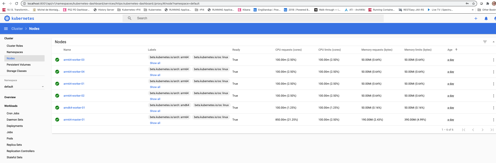

# Dashboard




## [Dashboard](https://github.com/kubernetes/dashboard/blob/master/docs/user/access-control/creating-sample-user.md)

**[18:39:42]donbuddenbaum@donbs-iMac:~/Documents/rPi4/kalaxy$** kubectl apply -f https://raw.githubusercontent.com/kubernetes/dashboard/v2.0.0-rc7/aio/deploy/recommended.yaml --validate=false
```
namespace "kubernetes-dashboard" created
serviceaccount "kubernetes-dashboard" created
service "kubernetes-dashboard" created
secret "kubernetes-dashboard-certs" created
secret "kubernetes-dashboard-csrf" created
secret "kubernetes-dashboard-key-holder" created
configmap "kubernetes-dashboard-settings" created
role "kubernetes-dashboard" created
clusterrole "kubernetes-dashboard" created
rolebinding "kubernetes-dashboard" created
clusterrolebinding "kubernetes-dashboard" created
deployment "kubernetes-dashboard" created
service "dashboard-metrics-scraper" created
deployment "dashboard-metrics-scraper" created
```

**[18:48:28]donbuddenbaum@donbs-iMac:~/Documents/rPi4/kalaxy$** kubectl apply -f CreatingaServiceAccount.yaml --validate=false
```
serviceaccount "admin-user" created
```
**[18:48:46]donbuddenbaum@donbs-iMac:~/Documents/rPi4/kalaxy$** kubectl apply -f CreatingaClusterRoleBinding.yaml --validate=false
```
clusterrolebinding "admin-user" configured
```

**[18:48:55]donbuddenbaum@donbs-iMac:~/Documents/rPi4/kalaxy$** kubectl -n kubernetes-dashboard describe secret $(kubectl -n kubernetes-dashboard get secret | grep admin-user | awk '{print $1}')
```
Name:		admin-user-token-jb9ln
Namespace:	kubernetes-dashboard
Labels:		<none>
Annotations:	kubernetes.io/service-account.name=admin-user
		kubernetes.io/service-account.uid=c4bbe64d-558b-4bce-b797-8473f151ff24

Type:	kubernetes.io/service-account-token

Data
====
token:		eyJhbGciOiJSUzI1NiIsImtpZCI6InB5UU9YemFPMkxrWFFESHkwU2w0QUJsdm5tY1Jub1A5NEdaOXlIMHVHTncifQ.eyJpc3MiOiJrdWJlcm5ldGVzL3NlcnZpY2VhY2NvdW50Iiwia3ViZXJuZXRlcy5pby9zZXJ2aWNlYWNjb3VudC9uYW1lc3BhY2UiOiJrdWJlcm5ldGVzLWRhc2hib2FyZCIsImt1YmVybmV0ZXMuaW8vc2VydmljZWFjY291bnQvc2VjcmV0Lm5hbWUiOiJhZG1pbi11c2VyLXRva2VuLWpiOWxuIiwia3ViZXJuZXRlcy5pby9zZXJ2aWNlYWNjb3VudC9zZXJ2aWNlLWFjY291bnQubmFtZSI6ImFkbWluLXVzZXIiLCJrdWJlcm5ldGVzLmlvL3NlcnZpY2VhY2NvdW50L3NlcnZpY2UtYWNjb3VudC51aWQiOiJjNGJiZTY0ZC01NThiLTRiY2UtYjc5Ny04NDczZjE1MWZmMjQiLCJzdWIiOiJzeXN0ZW06c2VydmljZWFjY291bnQ6a3ViZXJuZXRlcy1kYXNoYm9hcmQ6YWRtaW4tdXNlciJ9.MoXTJGZV68bB20oD3ZUaGteKkFTwDYhpJC9eHsbvI2PHxE37FI6li5XZdYjZ0fYxz3ek3qia0IKtxKRpePQ0egOYI1uBugzxq_9DpmhfdRhc_6aDTFFTdZclnzTd3-r96wLmHvNxWb3ZR6cKWSmSy_GnNY3Zwp2EHW5_LjefQd7mBBXyrNFDcp_pq4oP4YDGEQ8RKaFbGUi6m28Dd8Lud8zd1EhdV6Ao3tOMsskMjcQQCGseKFrci1trPop4yO23WBWTQXcKb8uGUBnPQel_HKEFvexq8JJGc5mU-GYKhRi_e9IbQ55dltHCy2V9U913yiVdAwiBCydx_j9BmHwDWA
ca.crt:		1025 bytes
namespace:	20 bytes
```