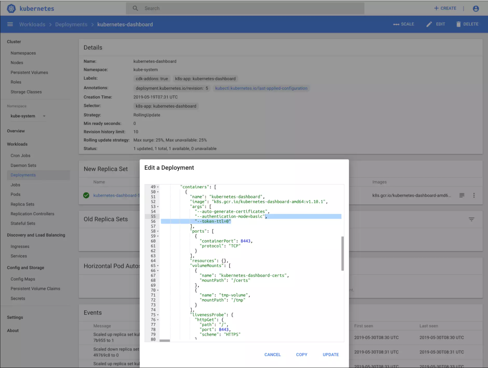
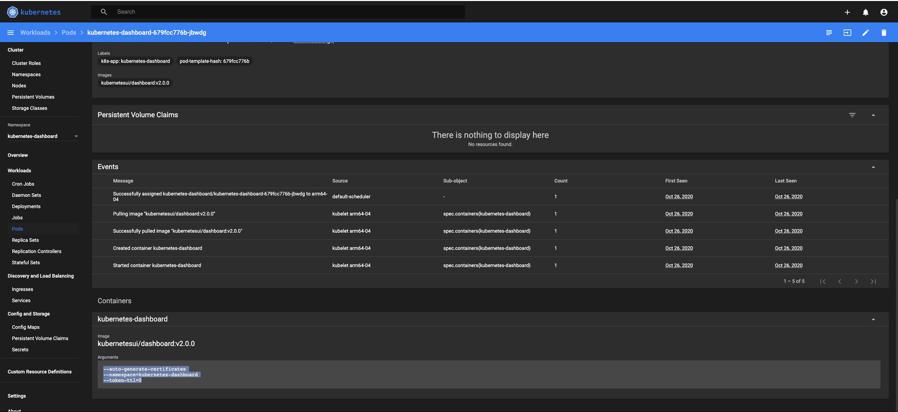

# Dashboard


[Kubernetes Dashboard](https://github.com/kubernetes/dashboard)

## [Dashboard](https://github.com/kubernetes/dashboard/blob/master/docs/user/access-control/creating-sample-user.md)

**[18:39:42]donbuddenbaum@donbs-iMac:~/Documents/rPi4/kalaxy$** kubectl apply -f https://raw.githubusercontent.com/kubernetes/dashboard/v2.0.0-rc7/aio/deploy/recommended.yaml --validate=false
```
namespace "kubernetes-dashboard" created
serviceaccount "kubernetes-dashboard" created
service "kubernetes-dashboard" created
secret "kubernetes-dashboard-certs" created
secret "kubernetes-dashboard-csrf" created
secret "kubernetes-dashboard-key-holder" created
configmap "kubernetes-dashboard-settings" created
role "kubernetes-dashboard" created
clusterrole "kubernetes-dashboard" created
rolebinding "kubernetes-dashboard" created
clusterrolebinding "kubernetes-dashboard" created
deployment "kubernetes-dashboard" created
service "dashboard-metrics-scraper" created
deployment "dashboard-metrics-scraper" created
```

**[18:48:28]donbuddenbaum@donbs-iMac:~/Documents/rPi4/kalaxy$** kubectl apply -f CreatingaServiceAccount.yaml --validate=false
   ```
serviceaccount "admin-user" created
```
**[18:48:46]donbuddenbaum@donbs-iMac:~/Documents/rPi4/kalaxy$** kubectl apply -f CreatingaClusterRoleBinding.yaml --validate=false
```
clusterrolebinding "admin-user" configured
```

**#( 10/24/20@ 4:13PM )( donbuddenbaum@donbs-iMac ):~/Documents/rPi4/kalaxy/yaml@master✗✗✗**  kubectl -n kubernetes-dashboard describe secret $(kubectl -n kubernetes-dashboard get secret | grep admin-user | awk '{print $1}')
```
Name:         admin-user-token-5vf6v
Namespace:    kubernetes-dashboard
Labels:       <none>
Annotations:  kubernetes.io/service-account.name: admin-user
              kubernetes.io/service-account.uid: 000195ce-772f-4a5b-85d7-2afdddfe7bb7

Type:  kubernetes.io/service-account-token

Data
====
ca.crt:     1025 bytes
namespace:  20 bytes
token:      eyJhbGciOiJSUzI1NiIsImtpZCI6ImstVk1XSWdsMXlLTWNyYzhncmY4SzU3WkVpYWVpZnRiTW96UGlUUHlmMHcifQ.eyJpc3MiOiJrdWJlcm5ldGVzL3NlcnZpY2VhY2NvdW50Iiwia3ViZXJuZXRlcy5pby9zZXJ2aWNlYWNjb3VudC9uYW1lc3BhY2UiOiJrdWJlcm5ldGVzLWRhc2hib2FyZCIsImt1YmVybmV0ZXMuaW8vc2VydmljZWFjY291bnQvc2VjcmV0Lm5hbWUiOiJhZG1pbi11c2VyLXRva2VuLTV2ZjZ2Iiwia3ViZXJuZXRlcy5pby9zZXJ2aWNlYWNjb3VudC9zZXJ2aWNlLWFjY291bnQubmFtZSI6ImFkbWluLXVzZXIiLCJrdWJlcm5ldGVzLmlvL3NlcnZpY2VhY2NvdW50L3NlcnZpY2UtYWNjb3VudC51aWQiOiIwMDAxOTVjZS03NzJmLTRhNWItODVkNy0yYWZkZGRmZTdiYjciLCJzdWIiOiJzeXN0ZW06c2VydmljZWFjY291bnQ6a3ViZXJuZXRlcy1kYXNoYm9hcmQ6YWRtaW4tdXNlciJ9.RdMzhkLOff7bm2ssZ9Grcg0r8SJlRUhD50LZNr2WUUK0wByNleBP5163Jiy7Gc5P11inObt2PPpdMRClUr_q7qY-Ua2gts4VU-7CZajaimye01mPO_PJgLTKy7ov3H9OqFdWDnqYCHV2ivfI9Y51D8OJL5jR8seDkfC11H1_DLwiutzKWVvHlRkq7AGU47QhIJAxqKQxpdyp3oJn0r-MdvNttN8jXAnKzeZMnURv1GEdxI5XG6eilQ_zt-DGLAAIyEqXAfR9DmUa7voUiTmqAvH-v952eJS-P78Pu2MxaYfa05mQMHGOTNkXkl8Bd70u_hLzYoHcKETdwSlw5iyrrw
```

[Kubernetes Dashboard Adjusting the timeout of the Kubernetes Dashboard](https://blinkeye.github.io/post/public/2019-05-30-kubernetes-dashboard/)




## dashboard -4
[Building a hybrid x86–64 and ARM Kubernetes Cluster](https://carlosedp.medium.com/building-a-hybrid-x86-64-and-arm-kubernetes-cluster-e7f94ff6e51d)


kubectl apply -f dashboard-admin-account.yaml
kubectl apply -f dashboard.yaml


## dashboard -> loadbalancer
[Expose your Kubernetes Dashboard using a LoadBalancer](https://github.com/alexandreroman/k8s-dashboard-loadbalancer)
[Bare metal load balancer on Kubernetes with MetalLB ](https://dev.to/drazisil/bare-metal-load-balancer-on-kubernetes-with-metallb-3h2k)
[TKS (TJ's Kubernetes Service)](https://github.com/zimmertr/Bootstrap-Kubernetes-with-QEMU/blob/master/playbooks/optional/deploy_dashboard.yml)

[https://github.com/kubernetes/dashboard/blob/master/docs/user/accessing-dashboard/README.md](https://github.com/kubernetes/dashboard/blob/master/docs/user/accessing-dashboard/README.md)
[https://gist.github.com/addshore/5e1fbfeb3bd97f8ebf50d68899c28fd5](https://gist.github.com/addshore/5e1fbfeb3bd97f8ebf50d68899c28fd5)


[https://blog.heptio.com/on-securing-the-kubernetes-dashboard-16b09b1b7aca](https://blog.heptio.com/on-securing-the-kubernetes-dashboard-16b09b1b7aca
)


#( 12/04/20@ 4:03AM )( dbuddenbaum@dbuddenbaum-mbp ):~/Documents/rPi4
   openssl req -nodes -newkey rsa:2048 -keyout certs/dashboard.key -out certs/dashboard.csr -subj "/C=/ST=/L=/O=/OU=/CN=kubernetes-dashboard"
Generating a 2048 bit RSA private key
................................................+++
..................................................................................................................+++
writing new private key to 'certs/dashboard.key'
-----
No value provided for Subject Attribute C, skipped
No value provided for Subject Attribute ST, skipped
No value provided for Subject Attribute L, skipped
No value provided for Subject Attribute O, skipped
No value provided for Subject Attribute OU, skipped
#( 12/04/20@ 4:03AM )( dbuddenbaum@dbuddenbaum-mbp ):~/Documents/rPi4
   openssl x509 -req -sha256 -days 365 -in certs/dashboard.csr -signkey certs/dashboard.key -out certs/dashboard.crt
Signature ok
subject=/CN=kubernetes-dashboard
Getting Private key
#( 12/04/20@ 4:03AM )( dbuddenbaum@dbuddenbaum-mbp ):~/Documents/rPi4
   cd certs
#( 12/04/20@ 4:04AM )( dbuddenbaum@dbuddenbaum-mbp ):~/Documents/rPi4/certs
   ls -la
total 24
drwxr-xr-x   5 dbuddenbaum  staff   160 Dec  4 04:03 .
drwxr-xr-x  15 dbuddenbaum  staff   480 Dec  4 04:01 ..
-rw-r--r--   1 dbuddenbaum  staff  1005 Dec  4 04:03 dashboard.crt
-rw-r--r--   1 dbuddenbaum  staff   907 Dec  4 04:03 dashboard.csr
-rw-r--r--   1 dbuddenbaum  staff  1704 Dec  4 04:03 dashboard.key
#( 12/04/20@ 4:05AM )( dbuddenbaum@dbuddenbaum-mbp ):~
   kubectl delete secret generic kubernetes-dashboard-certs  -n kubernetes-dashboard
cd ..
secret "kubernetes-dashboard-certs" deleted
Error from server (NotFound): secrets "generic" not found
#( 12/04/20@ 4:07AM )( dbuddenbaum@dbuddenbaum-mbp ):~/Documents/rPi4/certs
   kubectl create secret generic kubernetes-dashboard-certs --from-file=dashboard.crt -n kubernetes-dashboard
secret/kubernetes-dashboard-certs created
#( 12/04/20@ 4:08AM )( dbuddenbaum@dbuddenbaum-mbp ):~/Documents/rPi4/certs
   kubectl delete pod -n kubernetes-dashboard -l k8s-app=kubernetes-dashboard

pod "kubernetes-dashboard-64999dbccd-6pdlc" deleted
#( 12/04/20@ 4:09AM )( dbuddenbaum@dbuddenbaum-mbp ):~/Documents/rPi4/certs
