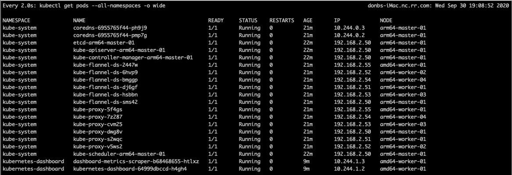

# Installation Notes

## Raspberry Pi Monitoring

```
sudo apt-get update && sudo apt-get install htop -y
```

## make up
```
xcode-select --install
```



## Flash

```bash
flash \
    --userdata setup/cloud-config.yml \
    ~/Downloads/ubuntu-20.04-preinstalled-server-arm64+raspi.img
    
```

## AMD64

### static ip
sudo vim /etc/netplan/01-netcfg.yaml

```

      network:
        version: 2
        ethernets:
          eth0:
            dhcp4: false
            addresses: [192.168.2.5?/24]
            gateway4: 192.168.2.253
            nameservers:
              addresses: [8.8.8.8, 4.4.4.4]

```
- sudo netplan apply
- ip address

### ssh
- sudo apt install ssh
- sudo systemctl enable --now ssh
- sudo systemctl status ssh

### swapfile

- sudo vim /etc/fstab 
```
#/swapfile

```
- sudo reboot

### update/upgrade

- sudo apt-get update
- sudo apt update
- sudo apt upgrade

### SUDO

sudo visudo

```

dbuddenbaum     ALL=(ALL) NOPASSWD=ALL

```