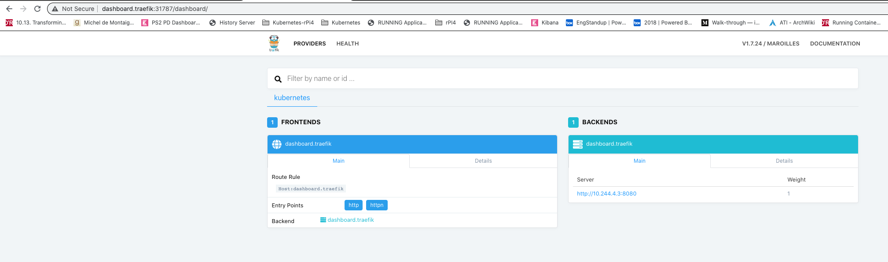

# Traefik



## Reference
- [Deploying Traefik as Ingress Controller for Your Kubernetes Cluster](https://medium.com/kubernetes-tutorials/deploying-traefik-as-ingress-controller-for-your-kubernetes-cluster-b03a0672ae0c)
- [How to Install Kubernetes Ingress (traefik) on a Raspberry Pi Cluster](https://medium.com/@geraldcroes/kubernetes-traefik-101-when-simplicity-matters-957eeede2cf8)

## Installation

**#( 10/26/20@ 6:54PM )( donbuddenbaum@donbs-iMac ):~/Documents/rPi4/kalaxy@master✗✗✗** kubectl create ns traefik
```
namespace/traefik created
```
**#( 10/26/20@ 6:55PM )( donbuddenbaum@donbs-iMac ):~/Documents/rPi4/kalaxy@master✗✗✗** helm install my-traefik stable/traefik --set dashboard.enabled=true,serviceType=NodePort,dashboard.domain=dashboard.traefik,rbac.enabled=true,externalIP=192.168.2.56 --namespace traefik
```
  WARNING: Kubernetes configuration file is group-readable. This is insecure. Location: /Users/donbuddenbaum/.kube/config
  WARNING: Kubernetes configuration file is world-readable. This is insecure. Location: /Users/donbuddenbaum/.kube/config
  NAME: my-traefik
  LAST DEPLOYED: Mon Oct 26 18:57:07 2020
  NAMESPACE: traefik
  STATUS: deployed
  REVISION: 1
  TEST SUITE: None
  NOTES:
  1. Traefik has been started. You can find out the port numbers being used by traefik by running:
  
            $ kubectl describe svc my-traefik --namespace traefik
  
  2. Configure DNS records corresponding to Kubernetes ingress resources to point to the NODE_IP/NODE_HOST
```
**[15:24:05]donbuddenbaum@donbs-iMac:~/Documents/rPi4/kalaxy$** kubectl describe svc my-traefik --namespace traefik
```
Name:                     my-traefik
Namespace:                traefik
Labels:                   app=traefik
                          app.kubernetes.io/managed-by=Helm
                          chart=traefik-1.87.2
                          heritage=Helm
                          release=my-traefik
Annotations:              meta.helm.sh/release-name: my-traefik
                          meta.helm.sh/release-namespace: traefik
Selector:                 app=traefik,release=my-traefik
Type:                     NodePort
IP:                       10.96.205.156
External IPs:             192.168.2.56
Port:                     https  443/TCP
TargetPort:               httpn/TCP
NodePort:                 https  30337/TCP
Endpoints:                10.244.3.2:8880
Port:                     http  80/TCP
TargetPort:               http/TCP
NodePort:                 http  31295/TCP
Endpoints:                10.244.3.2:80
Session Affinity:         None
External Traffic Policy:  Cluster
Events:                   <none>
```

**[16:16:47]donbuddenbaum@donbs-iMac:~/Documents/rPi4/kalaxy$** kubectl describe svc my-traefik-dashboard --namespace=traefik
```
Name:              my-traefik-dashboard
Namespace:         traefik
Labels:            app=traefik
                   app.kubernetes.io/managed-by=Helm
                   chart=traefik-1.87.2
                   heritage=Helm
                   release=my-traefik
Annotations:       meta.helm.sh/release-name: my-traefik
                   meta.helm.sh/release-namespace: traefik
Selector:          app=traefik,release=my-traefik
Type:              ClusterIP
IP:                10.96.78.171
Port:              dashboard-http  80/TCP
TargetPort:        8080/TCP
Endpoints:         10.244.3.2:8080
Session Affinity:  None
Events:            <none>
```


**/etc/hosts** 192.168.2.50 dashboard.traefik


## uninstall
helm uninstall mytraefik -n traefik

## examples

**[16:28:27]donbuddenbaum@donbs-iMac:~/Documents/rPi4/kalaxy/deployments$** kubectl create -f animals-deployments.yaml --validate=false
```
deployment "bear" created
deployment "moose" created
deployment "hare" created
```
**[16:33:41]donbuddenbaum@donbs-iMac:~/Documents/rPi4/kalaxy/deployments$** kubectl create -f animals-svc.yaml --validate=false
```
service "bear" created
service "moose" created
service "hare" created
```
**[16:39:32]donbuddenbaum@donbs-iMac:~/Documents/rPi4/kalaxy/deployments$** kubectl create -f animals-ingress.yaml --validate=false
```
ingress "animals" created
```

## Urls
- http://dashboard.traefik:31295/dashboard/
- http://animals.traefik:31295/moose/
- http://animals.traefik:31295/bear/
- http://animals.traefik:31295/hare/
 